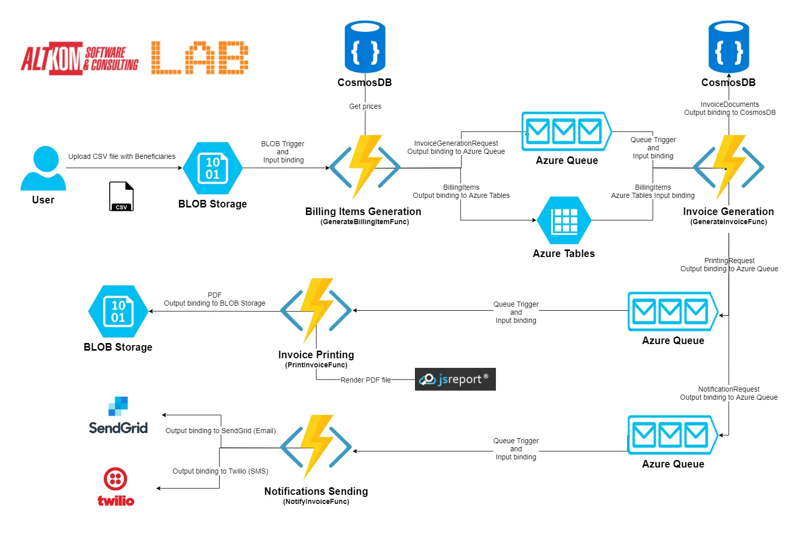
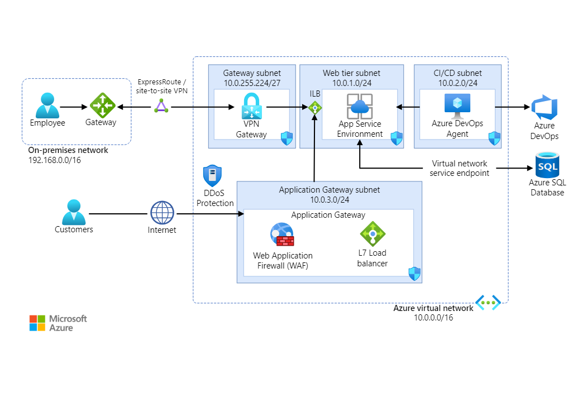

# **Azure Functions 2.0 – real world use case for serverless architecture**
## https://www.altkomsoftware.com/blog/azure-functions/
-   

**MY NUTES**:  
-   Using AZURE for Generating Invoice from a CSV file.  
-   Collect **price data** from **CosmoDB**.  
    -   **Generate** Invoice using **Functions**.  
        -   Use **QUEUES** and **TABLES**.
            -   **Store** the Invoice to **CosmosDB**.
        -   Use **QUEUES**.
            -   **Generate PDF** using **Function**.
        -   Use **QUEUES**.
            -   **Store** the PDF in **BLOB Storage**
            -   **Notify** the USER using **FUNCTIONS**

https://learn.microsoft.com/en-us/azure/architecture/example-scenario/apps/fully-managed-secure-apps
-   